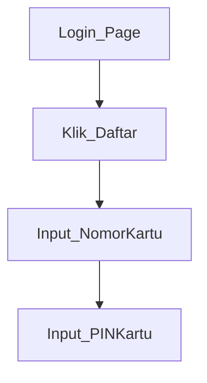

<!-- TITLE: SITAMOTO -->
<!-- SUBTITLE: Sitamoto Streetlight -->

# Overview
**Client** : PT. Visionet Data International    
**Periode Pengerjaan** : Januari-Juni 2018

Sitamoto merupakan platform dan aplikasi yang membantu manusia berinteraksi dengan beragam benda di dalam rumah, khususnya lampu. Interaksi yang dapat dilakukan melalui Sitamoto yaitu menyalakan atau mematikan lampu jarak jauh melalui aplikasi, menyalakan atau mematikan lampu secara otomatis dengan bantuan timer melalui aplikasi. Penerapan Sitamoto tidak terbatas hanya lampu, namun juga dapat membantu berbagai macam usaha dan bisnis untuk melakukan penghematan, optimasi dan meningkatkan efektivitas kerja.    

Untuk kebutuhan SmartLighting, Sitamoto menawarkan solusi pengaturan lampu jalan yang mudah, efisien dan tepat guna, membuat user memiliki kemampuan untuk memonitor kondisi lampu, jumlah besaran Listrik yang dikeluarkan, dan juga pengaturan nyala/mati lampu secara remote.

**Ruang Lingkup Sitamoto**    
1. Web Management digunakan untuk mengatur API yang digunakan disertai dengan informasi jumlah pemakaian dan jumlah device yang sudah digunakan untuk tiap akun.
2. Cloud API, API yang bersifat Restful untuk mengakses hardware dengan mudah melalui API yang sudah dipersiapkan dan disesuaikan dengan kebutuhan dari user. Cloud API bersifat public yang dapat di akses oleh developer Visionet dengan menggunakan credential tertentu. Detail API terdapat pada halaman berikutnya.
3. Produksi Hardware, produksi device CCU (Central Control Unit) dan Mini-CCU dilakukan oleh pihak VASCOMM dengan melalui proses fixasi penentuan jumlah produksi, Design Prototype, POC (Proof of Concept), Production, Quality Control, Finalisasi Produksi.
4. Kegiatan Instalasi dan Maintenance, VASCOMM menyediakan tenaga untuk melakukan instalasi dan maintenance pada jangka waktu yang telah disepakati bersama, adapun apabila kebutuhan maintenance dapat diprovide oleh pihak kedua, maka VASCOMM bersedia memberikan transfer knowledge terkait kebutuhan maintenance apa saja yang perlu dilakukan.
5. Operational, untuk kegiatan development menggunakan Cloud API milik VASCOMM, akan dibantu dan di assist oleh team Operational Maintenance jika terdapat masalah dan untuk membantu kelancaran proses pengembangan aplikasi milik VISIONET.

# Business Documentation
### Feature
|Device Management| |
|-----------------|---|
|Add Device||
|List Device||
|Detail Device|Detail kapan lampu diinstal, diaktifkan, dan status lampu saat ini nyala atau mati|

|CCU Management| |
|-----------------|---|
|Add CCU||
|List CCU||
|Detail CCU|Detail kapan lampu diinstal, diaktifkan, dan status lampu saat ini nyala atau mati|

### Flowchart

### Business Use Case

# Technical Documentation
